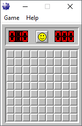
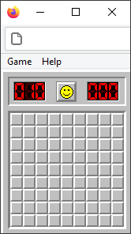
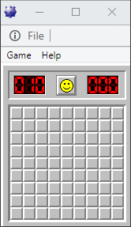
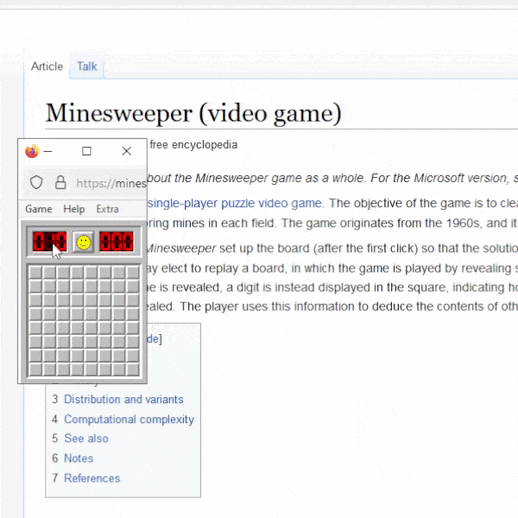
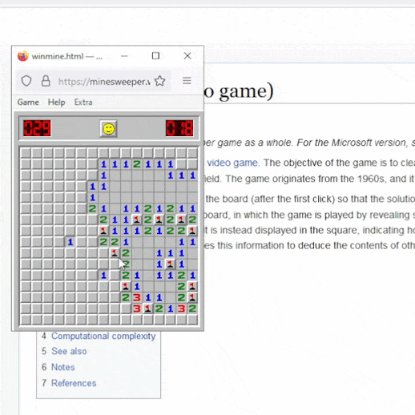
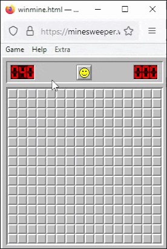
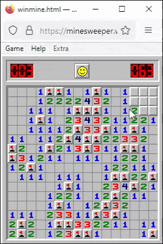

# WINMINE.HTML
## Window~~s~~ Minesweeper

__The classic Windows experience in a single file for your web browser.__

[winmine.html](https://minesweeper.win) <- Click to play

Minesweeper needs little introduction. A computer mouse point-and-click puzzle game with a simple timer and best times feature that made players gamers and speedrunners.

## Major Features
- Can look exactly like that old minesweeper game,  
with all the original menu features and styling
- Game history table browser with stats
- Save and import game history with csv files
- Rewatch and share playback of previous games
- Replay past boards
- Configure things like the pixel width and height of board cells,  
or the size of a beginner board, 8x8 (default) or 9x9
- 30kb compressed, no internet or external libraries needed,  
base html/css/js

## Screenshots

| winmine._exe_ | winmine.html (firefox) | winmine.html (chrome) |
| ----------- | ---------------------- | --------------------- |
| |  |  |

winmine.html will run on the common web browser + OS setups and is portable in one file.

For security, desktop browsers always show their url bar, and they always permit window resizing. The 8x8 beginner board is only 148px wide and user addons and other factors could affect the minimum window resolution allowed.

## Usage

- Play somewhere hosting a `winmine.html` file like [here](http://minesweeper.win/)
- Download a `winmine.html` file from a link below with your web browser's "Save page as..." or "Save link as..." option:   
[winmine.html](https://areasoft.github.io/winmine.html/winmine.html) (from github .io)  
[winmine.html](https://minesweeper.win/winmine.html)  (from minesweeper .win)  
- Example of a link to pop up a beginner window:

	```html
	<a href="#" onclick="window.open('minesweeper.win/winmine.html', 'Beginner', 'width=148,height=211');">winmine.html</a>
	```
- Example of a beginner window inside another page with an iframe:

	```html
	<iframe title="winmine.html" src="minesweeper.win/winmine.html" width="148px" height="211px"></iframe>
	```


Game save history is tied to the exact file location you play from. If you always play from the same spot, you will never notice. __It may be worth saving and importing__ from the Game History menu if you play from different places.


## Demos

#### All the Windows


&nbsp;

#### Stretchy Window


&nbsp;

#### Game History / Playback

 &nbsp;&nbsp;&nbsp;&nbsp;&nbsp;  / &nbsp;&nbsp;&nbsp;&nbsp;&nbsp; 

### License
This free playable art can be included in your web project. You can borrow all or any part of winmine.html - the simple MIT License in LICENSE.txt just means attribution back to me is required.

### Thanks for playing

Submitting issues, feedback, or contributing in any way is nice if you have some time. [Search discussions](https://github.com/areasoft/winmine.html/issues?q=) or [start a new one](https://github.com/areasoft/winmine.html/issues/new).

<br>
GG